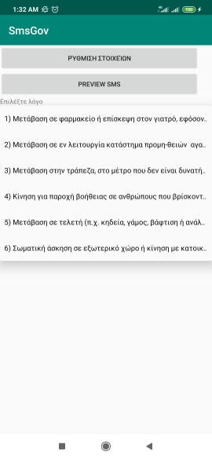

App to send messages to 13033 during the covid-19 incident.

Download and install forma_gov_sms.apk to your android phone.

## Select reason

Choose one of the six reasons mentioned here https://forma.gov.gr/docs/FAQ-apagorefsi.pdf

## Set fullname and Address

## Preview Sms

Before Sending sms you can preview the content just to be sure that it right.

