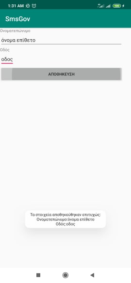

App to send messages to 13033 during the covid-19 incident.

Download and install forma_gov_sms.apk to your android phone. The mininum required API level has been set to 15, but it has been tested on Android >= 6 -- API level 23.

## Select reason

Choose one of the six reasons mentioned here https://forma.gov.gr/docs/FAQ-apagorefsi.pdf

## Set fullname and Address

## Preview Sms

Before Sending sms you can preview the content just to be sure that it right.

## Send Sms

Make sure to grant "send_sms" permissions when you click on the send button.
